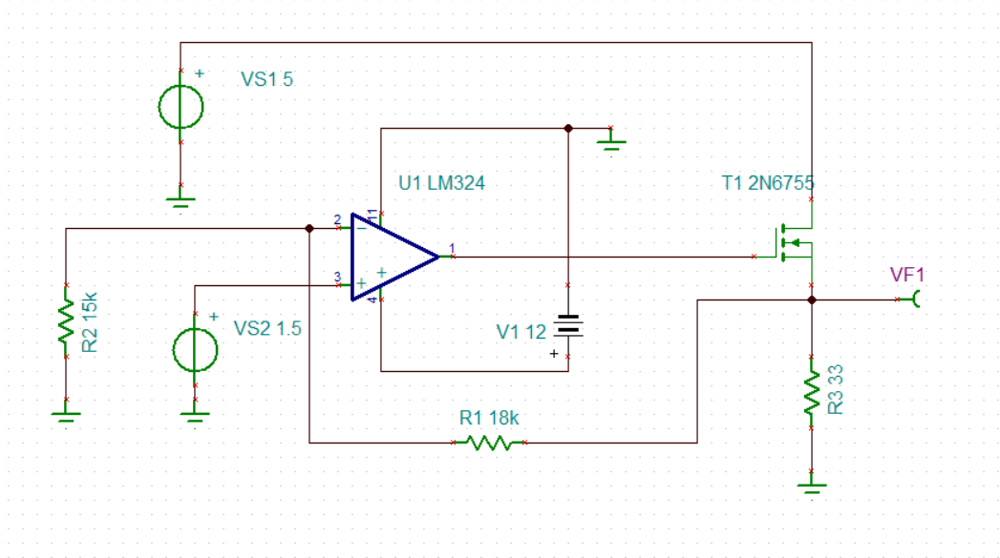
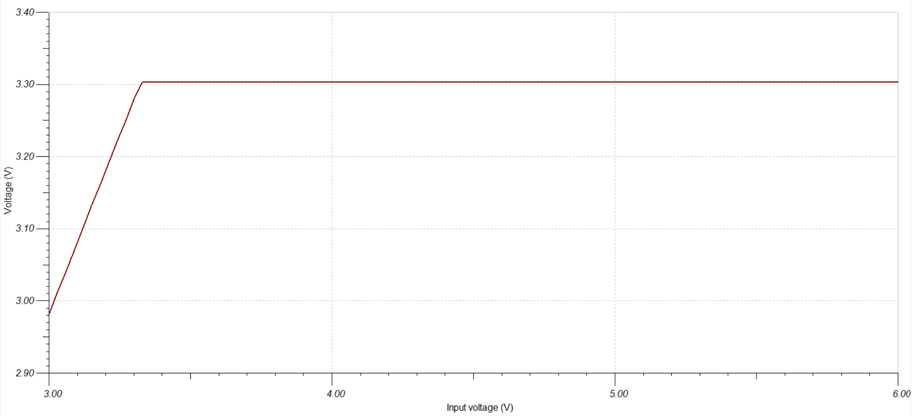
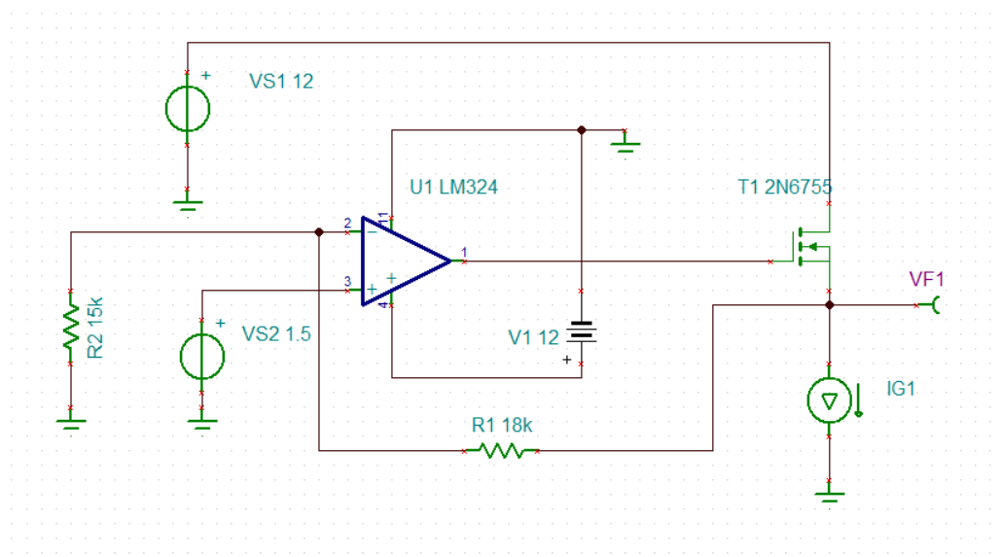
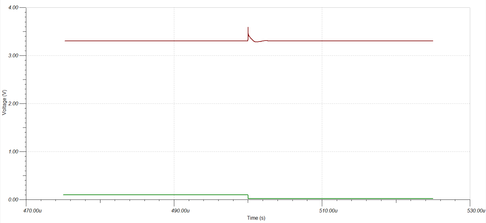
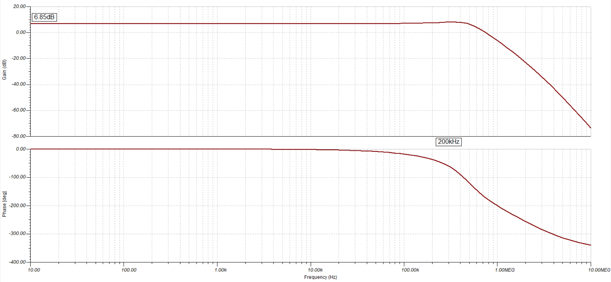

# 5V to 3.3V Low-Dropout (LDO) Regulator

## 📌 Project Overview
This repository contains the design and simulation of a continuous-time 5V to 3.3V Low-Dropout (LDO) voltage regulator. The circuit was designed and validated using **TINA-TI** to demonstrate core analog power management principles, specifically targeting low-noise sub-system rails where switching converter EMI is unacceptable.

## ⚙️ Architecture & Theory of Operation
The regulator utilizes an operational amplifier acting as an error amplifier to drive an NMOS pass transistor operating in its saturation region. 
* **The Feedback Loop:** An 18kΩ / 15kΩ resistive voltage divider samples the output voltage and feeds it back to the inverting (-) terminal of the op-amp.
* **Error Correction:** The non-inverting (+) terminal is tied to a stable 1.5V DC reference. Utilizing the virtual ground concept, the op-amp dynamically adjusts the NMOS gate voltage to maintain equilibrium, forcing the source output to exactly 3.3V.
* **Steady-State Error:** A minimal 3mV steady-state error was observed (3.303V output), which accurately reflects the finite open-loop gain limitations of the LM324 op-amp model.
* **Thermal Efficiency:** By utilizing a tight 1.7V dropout (5V input to 3.3V output), power dissipation across the pass transistor is minimized to safe levels (< 0.2W at 100mA) compared to standard large-dropout linear regulators.

## 🛠️ Component Selection
* **Error Amplifier:** LM324 Operational Amplifier 
* **Pass Element:** IRF540 N-Channel Power MOSFET 
* **Feedback Network:** 18kΩ / 15kΩ Standard E24 Resistors
* **Voltage Reference:** 1.5V DC Source

---

## 📊 Simulation Results

### 1. DC Operating Point & Line Regulation
The baseline circuit was tested with a static 33Ω load (drawing ~100mA). A DC voltage sweep was performed on the main supply rail from 3V to 6V.
* **Result:** The control loop successfully rejects supply fluctuations, holding a flat, regulated 3.3V output across the operational input range once the dropout threshold is met.

*Figure 1: Regulator Schematic with 33Ω Static Load*

*Figure 2: DC Transfer Characteristic showing Line Regulation*

### 2. Transient Response & Load Regulation
To test the speed and stability of the feedback loop, the static load was replaced with a square-wave Current Generator toggling between 20mA and 100mA at 1kHz.
* **Result:** The system demonstrated robust load regulation, rapidly correcting the voltage droop caused by the sudden current demand. The feedback loop achieved a highly responsive **~2.5 µs recovery time** to return to steady-state 3.3V.

*Figure 3: Regulator Schematic with Square-Wave Current Generator*

*Figure 4: Transient Analysis demonstrating 2.5 µs recovery time during load steps*

### 3. AC Small-Signal Analysis (Bode Plot)
A closed-loop AC transfer characteristic simulation was run from 10 Hz to 10 MHz to evaluate system stability and bandwidth.
* **Result:** The low-frequency gain sits precisely at ~6.85 dB, confirming the non-inverting voltage multiplier of 2.2. The loop exhibits a flat response up to ~400 kHz bandwidth, and rolls off smoothly without severe high-frequency peaking, indicating stable closed-loop dynamics with adequate phase margin.

*Figure 5: Closed-Loop AC Transfer Characteristic*

---
## 📂 Repository Structure
* `/TINA_TI_Schematics/` - Contains the runnable `.TSC` simulation files.
* `/Simulation_Plots/` - Exported Bode/Transient and DC sweep data.
* `/Images/` - High-resolution schematic captures.